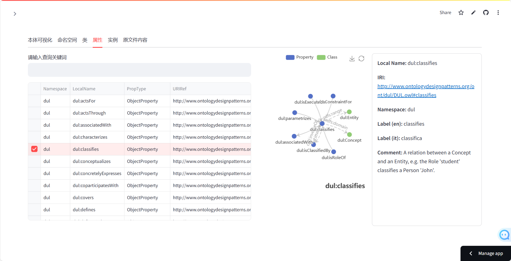

# Ontology Viewer

## Overview
Ontology Viewer is a simple Streamlit-based application designed to visualize and interact with ontology graphs. It provides functionalities to explore namespaces, classes, properties, and visualize hierarchical relationships within the ontology.

[](https://appontoviewer-w5pvvngndyhtwccjhkbpdu.streamlit.app/)

## Features
- **Graph Status Page**: Visualize namespaces, classes, and properties.
- **Class Hierarchy**: Display class inheritance relationships.
- **Property Hierarchy**: Display property inheritance relationships.
- **Metadata Display**: Show detailed metadata for selected nodes.
- **Ontology Export**: Export the ontology graph to a file.

## Installation
1. Clone the repository:
    ```sh
    git clone <repository-url>
    cd OntoViewer
    ```

2. Install the required dependencies:
    ```sh
    pip install -r requirements.txt
    ```

## Usage
1. Run the application:
    ```sh
    streamlit run app.py
    ```

2. Upload an ontology file (TTL, RDF, OWL) to start visualizing the ontology graph.

## File Structure
- `app.py`: Main entry point for the Streamlit application.
- `onto_viewer/`: Contains the core modules for the application.
  - `apps/`: Application-specific modules.
    - `viewer.py`: Main application logic for the Ontology Viewer.
  - `utils/`: Utility modules for various functionalities.
    - `echarts.py`: Utility functions for Echarts visualizations.
    - `graph_algo.py`: Utility functions for graph algorithms.
  - `namespaces.py`: Namespace definitions and utilities.
- `resources/ontologies/`: Directory containing ontology files.
  - `DUL.owl.ttl`: Example ontology file.

## Results

Entry:


Main:


Namespace:


Classes:


Properties:


Instances:


## Contributing
Contributions are welcome! Please fork the repository and submit pull requests.

## License
This project is licensed under the MIT License.

## Dependencies
The project requires the following dependencies:
- numpy==2.2.3
- pandas==2.2.3
- pydantic==2.10.6
- rdflib==7.1.3
- streamlit==1.42.0
- streamlit_echarts==0.4.0
- streamlit_extras==0.5.5

## To Do List
- [x] <span style="color:black;">Add support for SKOS-based semantics.</span>
- [ ] <span style="color:gray;">Add SPARQL query functionality.</span>
- [ ] <span style="color:gray;">Add functionality to create new classes.</span>
- [ ] <span style="color:gray;">Add functionality to create new properties.</span>
- [ ] <span style="color:gray;">Add functionality to display and set domain and range for properties.</span>
